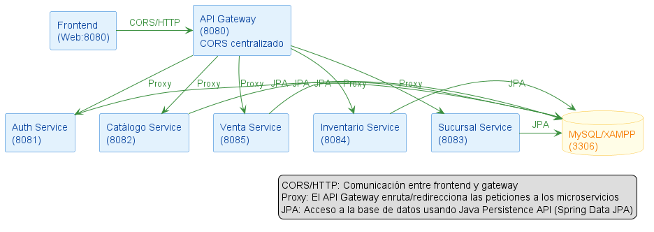

<p align="right">
  
</p>

# 🚴‍♂️ MasterBikes - MVP Microservicios

MasterBikes es una plataforma de e-commerce para bicicletas, accesorios y servicios, basada en microservicios. Permite a los usuarios autenticarse, ver el catálogo real, agregar productos al carrito y realizar compras registradas en el backend.

---

## 🏗️ Arquitectura General

| Componente         | Puerto | Descripción                        |
|--------------------|--------|------------------------------------|
| API Gateway        | 8080   | Centraliza rutas y CORS            |
| Auth Service       | 8081   | Usuarios y autenticación           |
| Catálogo Service   | 8082   | Bicicletas y componentes           |
| Sucursal Service   | 8083   | Gestión de sucursales              |
| Inventario Service | 8084   | Stock por sucursal                 |
| Venta Service      | 8085   | Registro de ventas y boletas       |
| Frontend           | 8090   | Interfaz web (HTML/JS/CSS)         |
| Base de datos      | 3306   | MariaDB/MySQL                      |

<p align="center">
  
</p>

---

## 🚦 Resumen de funcionalidades y pruebas

- **Autenticación JWT** y gestión de usuarios (Auth Service)
- **Catálogo real** de bicicletas/componentes (Catálogo Service)
- **Gestión de stock** por sucursal (Inventario Service)
- **Registro de ventas y boletas** (Venta Service)
- **Gestión de sucursales** (Sucursal Service)
- **Frontend web** moderno y responsivo
- **API Gateway** centraliza rutas, CORS y seguridad
- **Pruebas unitarias, integración y HATEOAS** en todos los microservicios
- **Documentación Swagger/OpenAPI** en todos los servicios

---

## 🔗 Endpoints y rutas Swagger

| Servicio           | Puerto | Swagger UI URL                        |
|--------------------|--------|---------------------------------------|
| Auth Service       | 8081   | [http://localhost:8081/swagger-ui.html](http://localhost:8081/swagger-ui.html) |
| Catálogo Service   | 8082   | [http://localhost:8082/swagger-ui.html](http://localhost:8082/swagger-ui.html) |
| Sucursal Service   | 8083   | [http://localhost:8083/swagger-ui.html](http://localhost:8083/swagger-ui.html) |
| Inventario Service | 8084   | [http://localhost:8084/swagger-ui.html](http://localhost:8084/swagger-ui.html) |
| Venta Service      | 8085   | [http://localhost:8085/swagger-ui.html](http://localhost:8085/swagger-ui.html) |
| API Gateway        | 8080   | (no Swagger, solo proxy)              |
| Frontend           | 8090   | (no Swagger, solo web)                |

> Prueba todos los endpoints desde Swagger UI o Postman. Usa el API Gateway (`http://localhost:8080/`) para simular el flujo real.

---

## 🧪 Pruebas automáticas y ejemplos

- **Pruebas unitarias y de integración:**
  - Ejecuta en cada microservicio:
    ```sh
    mvn test
    ```
  - Verifica que todos los tests pasen (`BUILD SUCCESS`).
- **Pruebas HATEOAS:**
  - Ejemplo: `GET /api/v1/ventas/1/hateoas` devuelve links navegables en la respuesta JSON.
- **Swagger UI:**
  - Accede a la documentación y prueba los endpoints en la URL correspondiente.
- **Postman:**
  - Usa los ejemplos de JSON de cada README para poblar y probar el sistema.

---

## 📦 Ejemplo de JSON para poblar y comprar

**Bicicleta (POST /api/v1/catalogo/bicicletas):**
```json
{
  "name": "Bicicleta Orion Futurista",
  "brand": "MasterBikes",
  "type": "Montaña",
  "size": "M",
  "price": 1599990,
  "image": "images/orion.jpg",
  "description": "Bicicleta futurista con tecnología avanzada, ideal para ciclistas competitivos.",
  "rating": 4.0
}
```

**Venta (POST /api/v1/ventas):**
```json
{
  "idCliente": 1,
  "productos": [ { "idBicicleta": 1, "cantidad": 1 } ],
  "total": 1850000,
  "sucursal": "CASA_MATRIZ"
}
```

---

## 🚢 Levantar todo con Docker

1. Instala Docker Desktop
2. Compila los microservicios:
   ```sh
   mvn clean package
   ```
3. Desde la raíz, ejecuta:
   ```sh
   docker-compose up --build
   ```
4. Accede a:
   - API Gateway: [http://localhost:8080](http://localhost:8080)
   - Frontend: [http://localhost:8090](http://localhost:8090)

---

## 🏆 Buenas prácticas y justificación

- **Separación de responsabilidades:** Cada microservicio es responsable de su lógica, pruebas y documentación.
- **Calidad y mantenibilidad:** Pruebas unitarias y de integración aseguran robustez y facilidad de evolución.
- **Swagger/OpenAPI:** Permite a cualquier desarrollador o evaluador entender y probar la API sin leer el código fuente.
- **HATEOAS:** Mejora la navegabilidad y el cumplimiento de buenas prácticas REST.
- **CI/CD Ready:** Todo el sistema puede ser probado automáticamente antes de desplegar.

---

## 🚀 Pruebas en vivo con Swagger y HATEOAS

Sigue estos pasos para demostrar el funcionamiento real del sistema en una presentación o defensa:

### 1. Login de usuario (Auth Service)
- Abre [http://localhost:8081/swagger-ui.html](http://localhost:8081/swagger-ui.html)
- Busca el endpoint `POST /auth/login`.
- Ejemplo de body:
  ```json
  {
    "email": "admin@masterbikes.com",
    "password": "admin123"
  }
  ```
- Haz clic en "Try it out" y ejecuta. Copia el token JWT de la respuesta.

### 2. Consultar catálogo (Catálogo Service)
- Abre [http://localhost:8082/swagger-ui.html](http://localhost:8082/swagger-ui.html)
- Prueba `GET /api/v1/catalogo/bicicletas` para ver el catálogo real.

### 3. Registrar una venta (Venta Service)
- Abre [http://localhost:8085/swagger-ui.html](http://localhost:8085/swagger-ui.html)
- Busca `POST /api/v1/ventas`.
- Ejemplo de body:
  ```json
  {
    "idCliente": 1,
    "productos": [ { "idBicicleta": 1, "cantidad": 1 } ],
    "total": 1850000,
    "sucursal": "CASA_MATRIZ"
  }
  ```
- Ejecuta y verifica la respuesta.

### 4. Probar endpoint HATEOAS (Venta Service)
- En Swagger UI de Venta Service, busca `GET /api/v1/ventas/{id}/hateoas`.
- Ingresa un ID de venta válido (por ejemplo, 1).
- Ejecuta y revisa que la respuesta incluya la sección `_links` con URLs navegables:
  ```json
  {
    "id": 1,
    ...
    "_links": {
      "self": { "href": "http://localhost:8085/api/v1/ventas/1/hateoas" },
      "ventas": { "href": "http://localhost:8085/api/v1/ventas" }
    }
  }
  ```

> Puedes repetir estos pasos para otros microservicios y endpoints. Todos los ejemplos son demostrables en vivo desde Swagger UI, sin necesidad de herramientas externas.

---